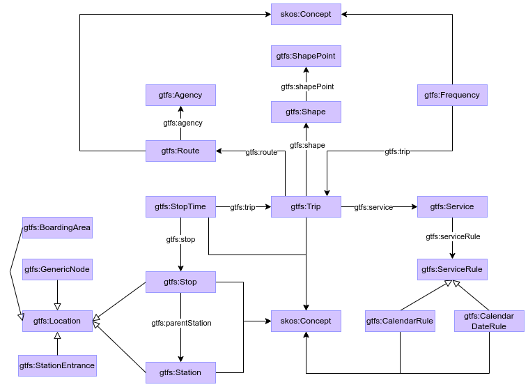

# BLINKG: A Benchmark for the Automation of Knowledge Graph Construction 

We present BLINKG, a benchmark for testing the capabilities of automatic solutions for the construction of
knowledge graphs from (semi)structured data. It provides:

- **Realistic scenarios**: A suite of progressively complex use cases, drawn from real-world data integration tasks, that challenge automatic solutions to align source fields with ontology concepts.

- **Standardized evaluation**: Clear metrics and gold-standard mappings to quantify precision, recall and overall mapping quality.

- **Extensible framework**: Standard data formats and evaluation scripts so that researchers can plug in new models, prompts or data sources in minutes.

## Benchmark Resources
We have divided the benchmark en three different scenarios, increasing their complexity. They can be found in the folder `scenarios`:

- Scenario 1: Schema-Aligned Mapping:
The structure and vocabulary of the input data closely match the target ontology. Mapping tasks involve straightforward identification of classes, properties, and entities. This scenario represents low-complexity environments where LLMs can operate with minimal ambiguity.

- Scenario 2: Functional and Partially Aligned Mapping:
Input data includes functional transformations and moderate divergence from the ontology schema. Tasks require interpreting formatting, value normalization, and simple logic operations. It models real-world cases with medium complexity in mapping design.

- Scenario 3: Schema-Distant and High Abstraction Mapping:
Input schemas and ontologies have minimal structural or lexical overlap. Tasks demand abstraction, contextual reasoning, and domain understanding to derive correct mappings. This scenario simulates the most challenging conditions for semantic alignment.

Tested features distributed by each scenario. Scenario 1 is divided in several atomic cases, while Scenarios 2 and 3 represent realistic KG construction scenarios:

| Features/Scenarios         | 1A | 1B | 1C | 1D | 1E | 1F | 1G | 1H | Scenario 2 GTFS | Scenario 3 PPDS |
|:--------------------------:|:--:|:--:|:--:|:--:|:--:|:--:|:--:|:--:|:---------------:|:---------------:|
| One data reference         | x  | x  | x  | x  | x  | x  | x  | x  | x               | x               |
| Two or more data references|    | x  | x  | x  | x  | x  | x  | x  | x               | x               |
| Complex object generation  |    |    |    | x  |    | x  | x  |    | x               | x               | 
| Simple subject generation  | x  | x  | x  |    | x  |    |    | x  | x               | x               |
| Complex subject generation |    |    |    | x  |    | x  | x  |    | x               | x               |
| Self join                  |    |    | x  |    |    |    | x  |    | x               | x               |
| Conditional join           |    |    |    |    | x  | x  | x  |    | x               | x               |
| Two or more input sources  |    |    |    |    |    | x  | x  | x  | x               | x               |
| Duplicate entities         |    |    |    | x  |    |    | x  | x  | x               | x               | 
| Datatypes generation       |    |    |    | x  |    |    | x  | x  | x               | x               |
| Language annotations       |    |    |    |    |    |    | x  | x  | x               | x               |
| Transformation Functions   |    |    |    |    |    |    |    |    | x               | x               |
| Distant Schemes            |    |    |    |    |    |    |    |    |                 | x               |

---

### Scenario 1: Schema-Aligned Mapping:
This scenario comprises a total of eight atomic cases, and it is inspired by the [RML test cases](https://kg-construct.github.io/rml-core/test-cases/docs/). Input data is provided for each use case in three different formats with the same content: CSV, JSON and XML.

### Scenario 2: Functional and Partially Aligned Mapping:
This scenario is inspired by the [GTFS-Madrid-Bench](https://github.com/oeg-upm/gtfs-bench) use case. It presents a more realistic and complex setting with task that frequently overlap and interact. The ontology was built from the official [GTFS specification](https://gtfs.org/documentation/overview/) using the classes listed in the following table. Input data is provided in CSV format. 

| Class  | Description |
|--------------------|-------------|
| Agency | Transit companies with service. |
| BoardingArea   | Location where passengers can board and/or alight vehicles. |
| CalendarRule   | Service dates specified using a weekly schedule with start and end dates. |
| CalendarDateRule   | Exception dates for the services. |
| Frequency  | Trip gap for frequency service or condensed schedule. |
| GenericNode| A location within a station, not matching any other location type. |
| Location   | Places where vehicles pick up or drop off riders. |
| Route  | Group of trips that are displayed to riders as a single service. |
| Service| Set of ServiceRules. |
| ServiceRule| Rule that associates dates with services (CalendarRule/CalendarDateRule). |
| Shape  | Rules for mapping vehicle travel paths. |
| ShapePoint | One point in a Shape. |
| Station| Large transit location that may contain multiple Stops. |
| StationEntrance| Location where passengers can enter or exit a station from the street. |
| Stop   | Physical location where a vehicle stops or leaves. |
| StopTime   | Times that a vehicle arrives at and departs from stops for each trip. |
| Trip   | Sequence of two or more stops that occur during a specific time period. |

### Scenario 3: Schema-Distant and High Abstraction Mapping:
This scenario is drawn from the [eProcurement Ontology (ePO)](https://github.com/OP-TED/ePO), the official European data model for public procurement. This ontology is highly complex and is under active, continious development. For this scenario, a subset of ePO's classes was used, that is listed in the following table. Input data is provided in XML format.

| Class  | Description |
|------------------------------------|-------------|
| AgentInRole| Ties an agent to a part they play in a given situational context. |
| Buyer  | Role of an agent that awards a contract and/or purchases items. |
| FrameworkAgreementTechniqueUsage   | Technique that establishes the terms governing contracts to be awarded. |
| Identifier | String to distinguish uniquely one instance of an object. |
| Lot| Division of the services to be procured, allowing the award of contracts. |
| LotAwardOutcome| Result concerning the Lot attributed by the awarder. |
| PrimaryRole| A primary role within the procurement process that ties an agent to a part. |
| Procedure  | Set of administrative activities conducted to conclude one or more contracts. |
| ResultNotice   | Announcement of the award or non-award of a contract by a buyer. |
| SubmissionStatisticalInformation   | Statistical information about submissions on a given Lot. |
| TechniqueUsage | Methods used for conducting procurement procedure. |

## Benchmark Metrics

### Cell similarity 
To assess the quality of the mappings produced by LLMs, we define a flexible and task-sensitive evaluation metric based on semantic similarity. Instead of relying solely on exact string matches, which often fail to recognize paraphrases or synonymous terms, we compute three complementary similarity scores between predicted and reference values:
- Levenshtein distance (normalized): captures character-level similarity.
- Cosine similarity over raw embeddings: using SBERT or any similar LM to compare textual outputs semantically.
- Cosine similarity over ontology verbalizations: comparing descriptions or labels of ontology elements.

For each cell in a predicted table, the metric selects the maximum similarity among these three and compares it against a threshold τ. If the score exceeds the threshold, the annotation is marked as correct. This allows the metric to be robust across tasks of varying complexity—such as class matching, datatype identification, or join condition specification—while remaining sensitive to lexical variation.

### Row matchting
Before evaluating the predicted tables, each generated row must be aligned with the corresponding gold standard row. Since LLMs may reorder or transform input data, a direct row-by-row comparison is unreliable. To address this, we implement a semantic row matching step.
The primary matching criterion is the Ontology Property, as it usually contains uniquely identifying values per row. We compute similarity using multiple measures (Levenshtein distance, embedding-based cosine similarity, and ontology verbalization similarity) to find the closest match.
If the Ontology Property is ambiguous or insufficiently discriminative (e.g., contains repeated or noisy values), we fall back to a composite key using Entity Class and Data Reference, which we identified empirically as the most informative pair of fields across scenarios.
This step ensures that each predicted row is compared against the most appropriate reference, minimizing false negatives due to misalignment.

## Results

Results of our experimental evaluation can be found in `evaluation`. We evaluated six different LLMs: 
Deepseek, Gemini 2.5 pro, GPT-4 Omni, LLama-3.3-70B, Mixtral 8x22B and OpenAI o3. First, we present the similarity scores to analyze how each LLM performs across mapping tasks. Then, we show the F-score values for each evaluation setting (expert-based, raw, and post-processed). For adapting similarity measures to F1-score graphics, a threshold of 0.8 is used.

### Scenario 1
<figure style="text-align: left;">
    

    
    
    
    
    
    
    
    
    

    
<em>
        Similarity score across the eight configurations (A-D top, E-H bottom) with respect to the gold standard in the Scenario 1. It is only shown the post-processed case, as there are no significant differences between them and the raw ones.
    </em>

</figure>

<figure style="text-align: left;">
    

    
    
    
    

    
<em>
        Comparison of the F-score between the three different evaluations in the Scenario 1, expert-based (left), raw (center), and post-processed (right).
    </em>

</figure>

### Scenario 2

<figure style="text-align: left;">
    

    
    
    

    
<em>
        Similarity between raw (left) and post-processed (right) configurations with respect to the gold standard in Scenario 2.
    </em>

</figure>

<figure style="text-align: left;">
    

    
    
    
    

    
<em>
        Comparison of the F-score between the three different evaluations in the Scenario 2, expert-based (left), raw (center), and post-processed (right).
    </em>

</figure>

### Scenario 3

<figure style="text-align: left;">
    

    
    
    

    
<em>
        Similarity between raw (left) and post-processed (right) configurations with respect to the gold standard in Scenario 3.
    </em>

</figure>

<figure style="text-align: left;">
    

    
    
    
    

    
<em>
        Comparison of the F-score between the three different evaluations in the Scenario 3, expert-based (left), raw (center), and post-processed (right).
    </em>

</figure>

## Authors

- David Chaves-Fraga (main contact) - david.chaves at usc.es
- Carla Castedo

CiTIUS - University of Santiago de Compostela, July 2025 - Present
